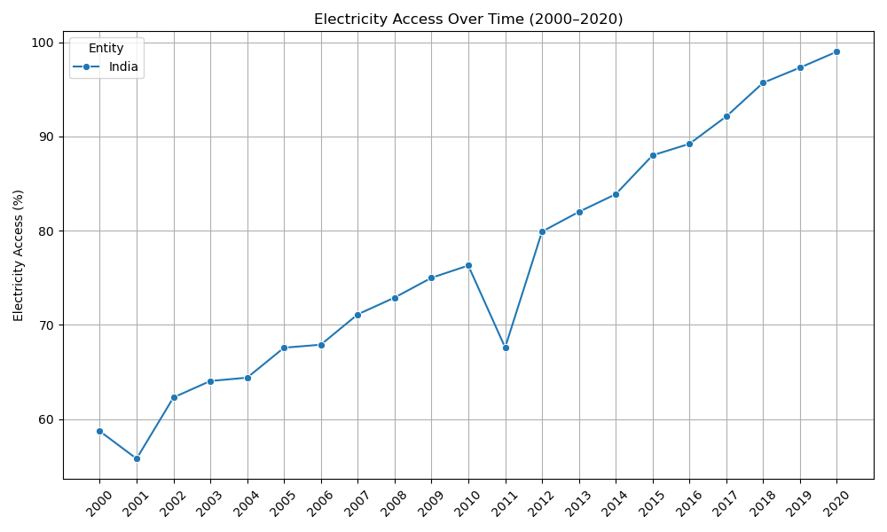
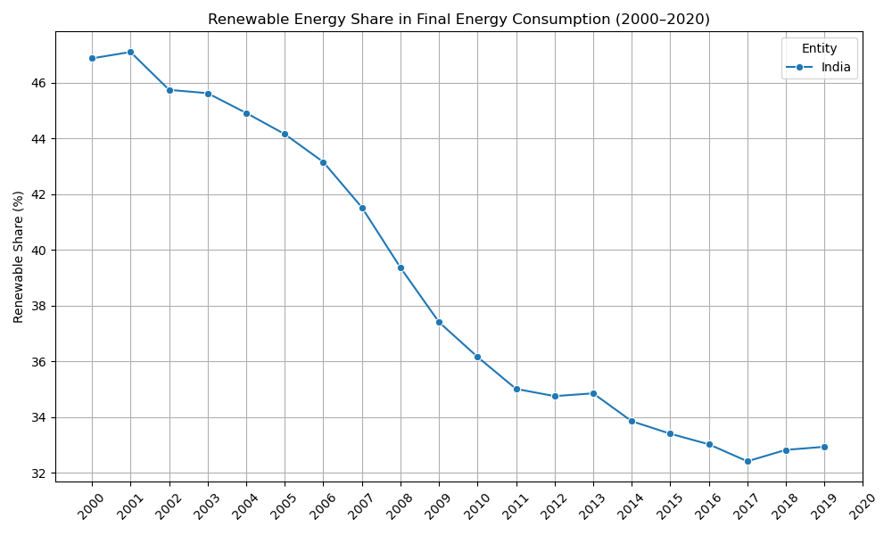
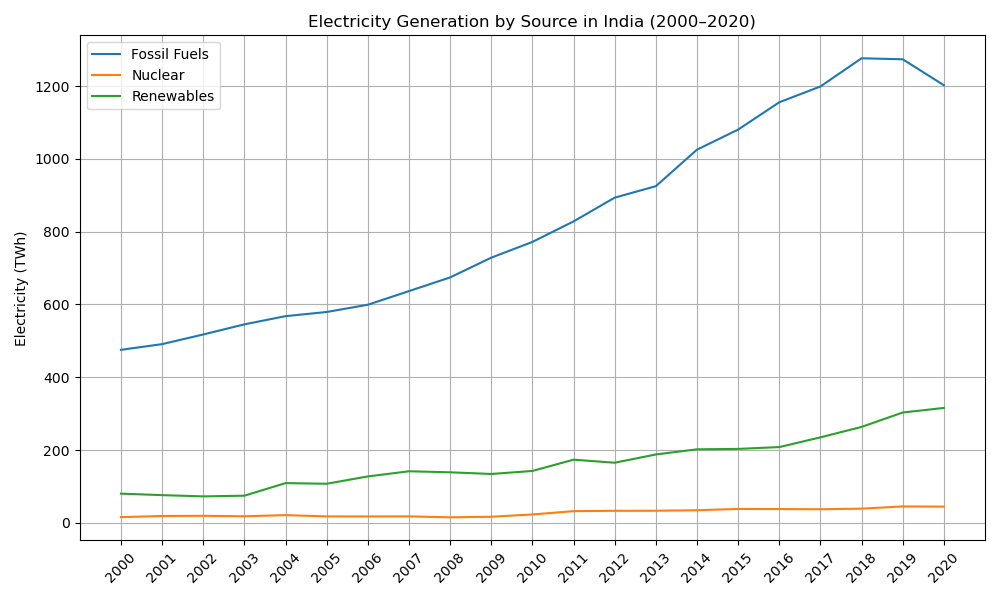

## Introduction
India has experienced a rapid development in the recent decades, with growing GDP, and almost universal access to electricity.
But I notice something surprising: in the early 2000s, nearly half of India's power came from renewable energy. 
By 2019, the share had declined to below 35%. Isn't renewable energy supposed to grow as a country develops?

In this project, I want to discuss the reasons behind this contradiction. 
Did renewable energy output shrink, or did other sources of power grow even faster? 
That's what I want to find out.

---

## Dataset Overview
The dataset used for this project is [Global Data on Sustainable Energy (2000-2020)](https://www.kaggle.com/datasets/anshtanwar/global-data-on-sustainable-energy) by ANSH TANWAR, published on Kaggle.

This dataset contains:
- **Time span** : 2000 - 2020
- **Number of countries** : 176
- **Number of indicators** : 21

But I will only focus on **India**, and use a selected set of indicators:
- **Access to electricity (% of population)**
- **Renewable energy share in the total final energy consumption (%)**
- **Electricity from different sources (fossil fuels, nuclear, renewables) (TWh)**
- **Value CO2 emissions (kt)**

---

## Methodology
To investigate, I will perform the following steps:
- Plot the time series of **Access to electricity (% of population)** to confirm the rapid expansion.
- Plot the trend of **Renewable energy share in total final energy consumption (%)** for comparison.
- Visualize **Electricity generation by source** (fossil fuels, nuclear, renewables in TWh) to determine if non-renewable sources have grown faster.
- Include **CO₂ emissions (kt)** or other indicators if necessary.

---

## Visualization

### Figure 1 - Access to electricity in India (2000 - 2020)

Electricity access increased from around 60% in 2000 to almost 100% in 2020.

### Figure 2 - Renewable energy share in India (2000 - 2020)

Renewable energy share drop from above 46% in 2000 to below 34% in 2020.

### Figure 3 - Electricity Generation by Source in India (2000 - 2020)

Fossil fuels skyrocketed while renewable energy had a steady growth.
