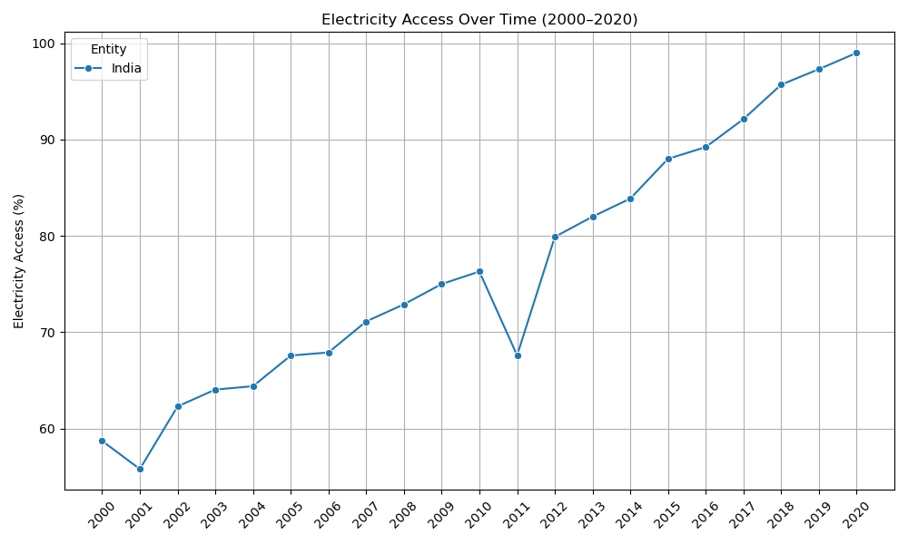
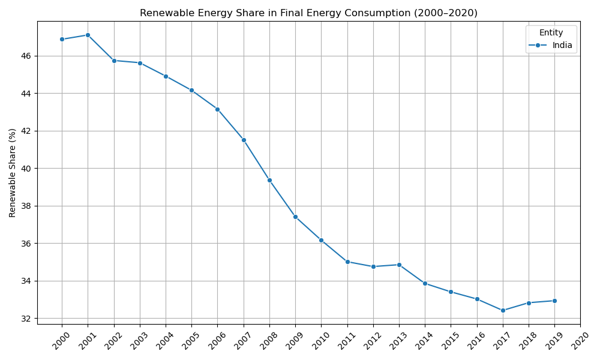
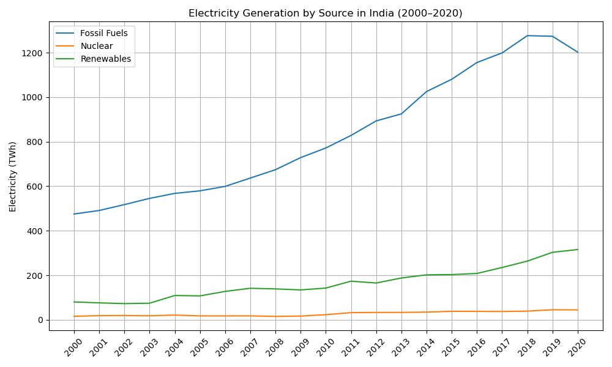

## Introduction
India has experienced a rapid development in the recent decades, with growing GDP, and almost universal access to electricity.
But I notice something surprising: in the early 2000s, nearly half of India's power came from renewable energy. 
By 2019, the share had declined to below 35%. Isn't renewable energy supposed to grow as a country develops?

In this project, I want to discuss the reasons behind this contradiction. 
Did renewable energy output shrink, or did other sources of power grow even faster? 
That's what I want to find out.

---

## Dataset Overview
The dataset used for this project is [Global Data on Sustainable Energy (2000-2020)](https://www.kaggle.com/datasets/anshtanwar/global-data-on-sustainable-energy) by ANSH TANWAR, published on Kaggle.

This dataset contains:
- **Time span** : 2000 - 2020
- **Number of countries** : 176
- **Number of indicators** : 21

But I will only focus on **India**, and use a selected set of indicators:
- **Access to electricity (% of population)**
- **Renewable energy share in the total final energy consumption (%)**
- **Electricity from different sources (fossil fuels, nuclear, renewables) (TWh)**
- **Value CO2 emissions (kt)**

---

## Methodology
To investigate, I will perform the following steps:
- Plot the time series of **Access to electricity (% of population)** to confirm the rapid expansion.
- Plot the trend of **Renewable energy share in total final energy consumption (%)** for comparison.
- Visualize **Electricity generation by source** (fossil fuels, nuclear, renewables in TWh) to determine if non-renewable sources have grown faster.
- Include **CO₂ emissions (kt)** or other indicators if necessary.

---

## Visualization

### Figure 1 - Access to electricity in India (2000 - 2020)

Electricity access increased from around 60% in 2000 to almost 100% in 2020.

### Figure 2 - Renewable energy share in India (2000 - 2020)

Renewable energy share drop from above 46% in 2000 to below 34% in 2020.

### Figure 3 - Electricity Generation by Source in India (2000 - 2020)

Fossil fuels skyrocketed while renewable energy had a steady growth.

---

## Discussion
We can observe that energy generated from **fossil fuels** rose significantly throughout the 2000s and peaked around 2018. 
Meanwhile, energy from **renewable sources** showed a steady yet slowly increase over the same period.

In my opinion, this could explain why share of **renewable energy** declined sharply between 2000 - 2020 -
not because **renewable energy** decreased, but because fossil fuels generation expanded much more rapidly.

---

## Conclusion
In this mini project, we explored the performance of **renewable energy** in **India**.  
Despite rapid growth in economy and electricity access, the share of renewable energy declined significantly between 2000 and 2020.

This trend might result from the explosive growth of fossil fuel usage, which tends to be cheaper and more accessible.  
However, based on recent trends, we may see **renewables start to regain share** in the coming years.

